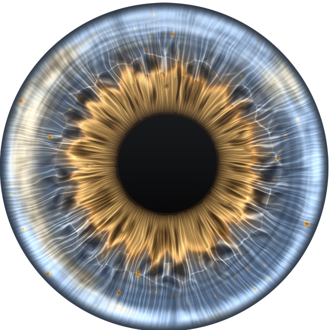

# Stroma



**The demo runs at <https://woldbye.github.io/Stroma/>** — the eye face on, with each of its
anatomical layers on a switch. It needs WebGL2, and says so in place of the eye where it cannot
start.

A procedural model of the human iris in WebGL2, face on, with a pupil that contracts and
dilates like the organ. The structure is built one anatomical layer at a time, each its own
unit of shader code: the pupillary ruff, the collarette, the stromal fibres, the trabeculae
and the crypts of Fuchs between them, the peripheral ciliary zone, the contraction furrows
and the radial furrows, the pigment. The pupil follows the light reflex of Pamplona, Oliveira
and Baranoski, with hippus. Six palettes, each picked from a reference photograph.

Stack: Vue 3, Vite, TypeScript, [ogl](https://github.com/oframe/ogl) on WebGL2, Tailwind,
[shadcn-vue](https://www.shadcn-vue.com/) on reka-ui.

## The demo

- **Eye**: six eyes, one per reference photograph, each with its own palette and the few
  structural knobs that differ between them.
- **Drawn as**: Tissue, the eye in colour; Structure, the same form as uncoloured clay;
  Geometry, the model's coordinates drawn over the tissue.
- **Light**: Night, Indoors, Daylight. The pupil answers through the light reflex, with hippus,
  at its own pace.
- **Layers**: a switch for each of thirteen anatomical layers, centre outward, from the
  pupillary ruff to the cornea and lid. Switching them off strips the eye down to its
  coordinates; switching them back on shows what each adds. A layer an eye does not have is
  greyed out.

On a phone the eyes stay under the iris, and the light and the layers open in a drawer from the
Controls button.

## Commands

```sh
pnpm install
pnpm dev          # the demo at http://localhost:5173, the harness at /#harness
pnpm type-check
pnpm lint         # oxlint, then eslint, both fixing, then the shaders parsed as GLSL ES 3.00
pnpm format
pnpm build
```

## How it renders

Two passes. The bake draws the iris's structure into textures at a rest pupil, in the model's
own coordinates: the angle around the pupil and the width across the iris from the pupil
margin to the root. It re-runs only when a structural knob or the size changes. The present
pass maps every screen pixel to the tissue it shows for the live pupil, so contraction is a
radial remap of the sample point, then colours it and scales the furrows with the pupil.
Moving the pupil costs one texture read per pixel; changing a colour costs nothing. Nothing in
the per-frame path allocates.

The remap is linear in the width, which is the model rather than an approximation: tracked
through dilation, a point's distance from the margin stays a constant fraction of the local
iris width, and the biomechanical correction to that is about one percent of the diameter.

## Files

- `src/iris/iris-shaders.ts` — the bake and present shaders, one function per layer, the
  knobs and which of them re-bake. Every knob is grounded in a millimetre figure.
- `src/iris/iris-scene.ts` — the two programs, the render target between them, the eased
  knobs, the settle check and the reflex.
- `src/iris/pupil-dynamics.ts` — the pupil: a delay-differential model of the light reflex in
  millimetres, with hippus as band-limited noise.
- `src/iris/iris-palettes.ts` — the presets, one per reference photograph.
- `src/iris/iris-mount.ts` — mounting the iris on an element and driving its frames.
- `src/demo/IrisDemo.vue` — the demo page: its state, and which control goes in which slot.
- `src/demo/iris-layers.ts`, `src/demo/iris-eyes.ts` — the thirteen layers with the knob values
  that switch each off, and the six eyes, their swatches derived from the palettes.
- `src/composables/use-iris.ts` — where the demo drives the model: mounting, frames and
  applying the state.
- `src/composables/use-breakpoints.ts` — Tailwind's breakpoints as reactive flags.
- `src/components/layout/` — `AppLayout` and the desktop and phone layouts it chooses between.
- `src/components/controls/` — the controls, which take plain data and may not import the
  model; ESLint enforces it.
- `src/components/ui/` — shadcn-vue primitives, taken from its repository at a pinned commit.
- `src/dev/IrisHarness.vue` — the bench: size, pupil, reflex, palette, coordinate lines,
  timings, a pixel difference against a pinned render.

## License

[MIT](LICENSE).
